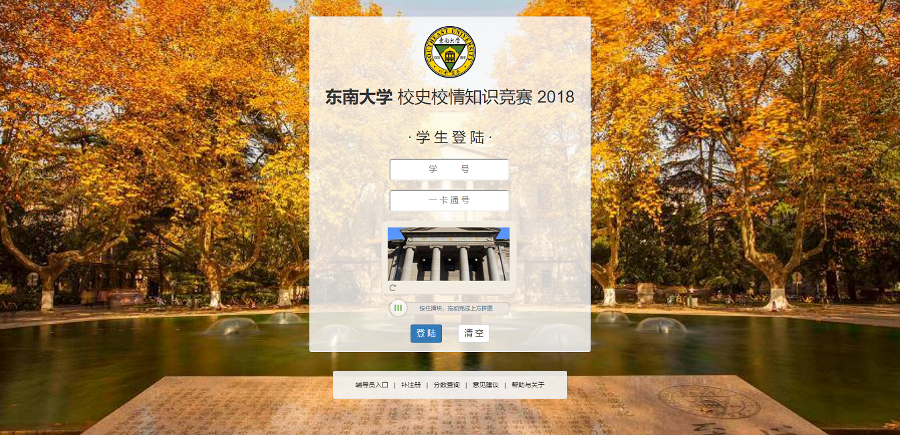

## [typed-webgl](https://github.com/z0gSh1u/typed-webgl)

| 状态                  | 语言/技术栈 |
| --------------------- | ----------- |
| **:sparkles:** 已完工(团队项目)  | TypeScript + WebGL   |

## [tinydragon](https://github.com/z0gSh1u/tinydragon)

| 状态                  | 语言/技术栈 |
| --------------------- | ----------- |
| **:construction:** 施工中 | TypeScript   |

## [kramup](https://github.com/z0gSh1u/kramup)

| 状态                  | 语言/技术栈 |
| --------------------- | ----------- |
| **:construction:** 施工中 | C# + WPF   |

## [chinadle](https://github.com/z0gSh1u/chinadle)

| 状态                  | 语言/技术栈 |
| --------------------- | ----------- |
| **:sparkles:** 已完工 | Vue 2       |

## [seu-viz](https://github.com/z0gSh1u/seu-viz)

| 状态                  | 语言/技术栈 |
| --------------------- | ----------- |
| **:sparkles:** 已完工 | C++ + OpenGL      |

## [nlm-cuda](https://github.com/z0gSh1u/nlm-cuda)

| 状态                  | 语言/技术栈 |
| --------------------- | ----------- |
| **:sparkles:** 已完工 | CUDA      |

## [seu-lex-yacc](https://github.com/z0gSh1u/seu-lex-yacc)

| 状态                  | 语言/技术栈 |
| --------------------- | ----------- |
| **:sparkles:** 已完工 | TypeScript      |

## [VCampus](https://github.com/z0gSh1u/VCampus)

| 状态                  | 语言/技术栈 |
| --------------------- | ----------- |
| **:sparkles:** 已完工 | Java + MyBatis      |

## [expshell](https://github.com/z0gSh1u/expshell)

| 状态                  | 语言/技术栈 |
| --------------------- | ----------- |
| **:sparkles:** 已完工 | C++      |

## [vscode-ts-getset](https://github.com/z0gSh1u/vscode-ts-getset)

| 状态                  | 语言/技术栈 |
| --------------------- | ----------- |
| **:sparkles:** 已完工 | TypeScript     |

## [minisys-minicc-ts](https://github.com/seu-cs-class2/minisys-minicc-ts)

| 状态                  | 语言/技术栈 |
| --------------------- | ----------- |
| **:sparkles:** 已完工(团队项目) | TypeScript     |

## [minisys-asm](https://github.com/seu-cs-class2/minisys-asm)

| 状态                  | 语言/技术栈 |
| --------------------- | ----------- |
| **:sparkles:** 已完工(团队项目) | TypeScript     |

## [minisys-1a-cpu](https://github.com/seu-cs-class2/minisys-1a-cpu)

| 状态                  | 语言/技术栈 |
| --------------------- | ----------- |
| **:sparkles:** 已完工(团队项目) | Verilog     |

## [东南大学校史校情知识竞赛系统（2018）](https://github.com/z0gSh1u/seu-history-competition-2018)

| 状态                  | 语言/技术栈 |
| --------------------- | ----------- |
| **:sparkles:** 已完工 | PHP         |

